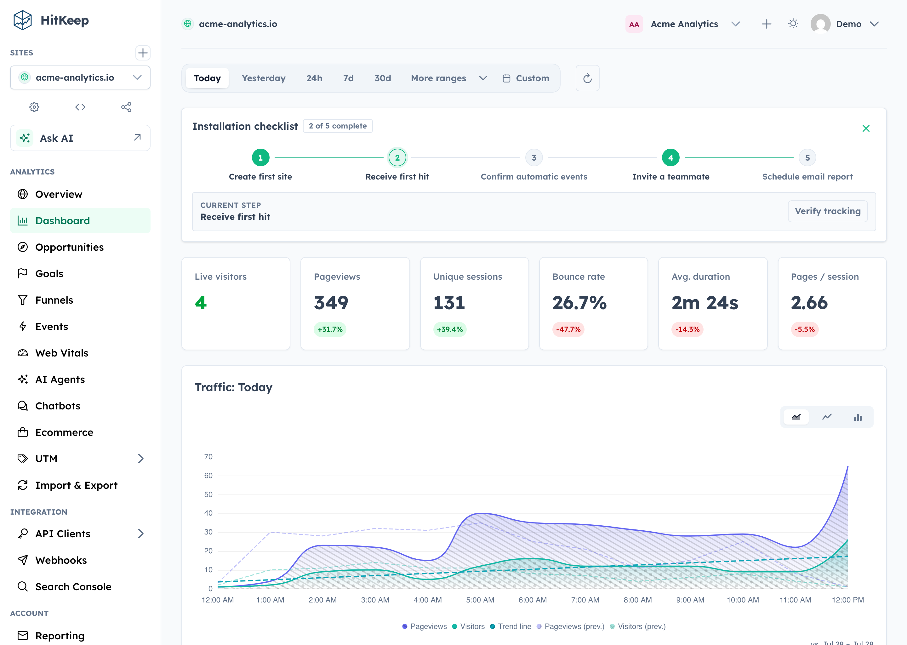
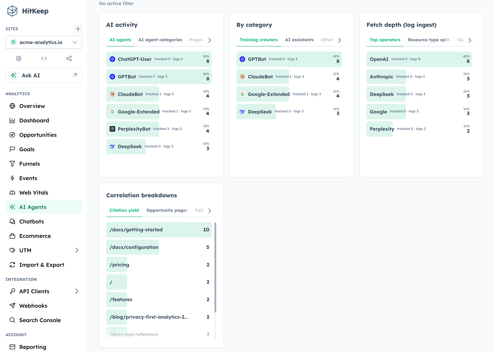
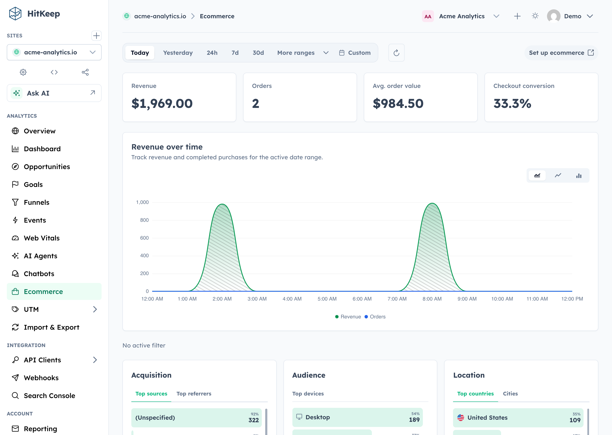
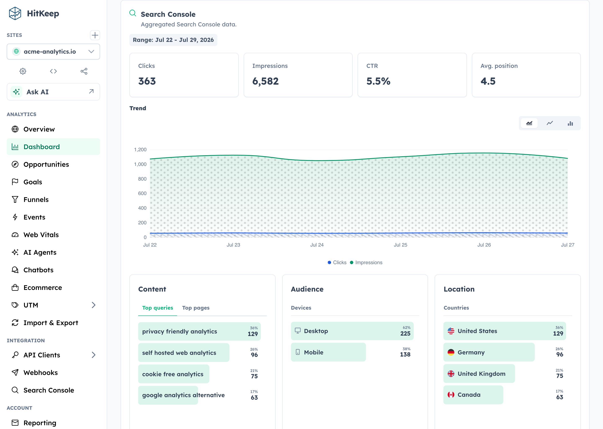

<p align="center">
  <picture>
    <source media="(prefers-color-scheme: dark)" srcset="./frontend/dashboard/public/hitkeep-wordmark-white.png">
    <source media="(prefers-color-scheme: light)" srcset="./frontend/dashboard/public/hitkeep-wordmark-blue.png">
    
  </picture>
</p>

<h1 align="center">AI native, sovereign, privacy-first web analytics in one binary.</h1>

<p align="center">
  100% open source under MIT, HitKeep unifies traffic, conversions, Search Console, and AI visibility with custom tracking domains, SSO, open exports, and no separate database, queue, or cache.
</p>

<p align="center">
  <a href="https://hitkeep.com/guides/installation/">Self-host</a> ·
  <a href="https://hitkeep.com/guides/introduction/">Documentation</a> ·
  <a href="https://hitkeep.com/cloud">Cloud</a> ·
  <a href="https://hitkeep.com">Website</a>
</p>

<p align="center">
  <a href="https://github.com/PascaleBeier/hitkeep/releases"></a>
  <a href="https://github.com/PascaleBeier/hitkeep/actions/workflows/ci.yml"></a>
  <a href="./LICENSE"></a>
  <a href="https://hub.docker.com/r/pascalebeier/hitkeep"></a>
  <a href="https://www.bestpractices.dev/projects/11990"></a>
</p>



## Why HitKeep

- **100% open source.** The complete product is MIT-licensed. Custom tracking domains and team SSO live in the same public codebase—not in a separate proprietary edition.
- **Full data sovereignty.** Self-host one Go binary with embedded DuckDB and NSQ, or export your data in open formats. Complete takeout, APIs, webhooks, share links, and permissions keep the data useful outside HitKeep.
- **AI-native analytics.** HitKeep treats AI as a first-class traffic channel: crawler fetches, AI-referred visits, and chatbot outcomes remain distinct. Ask AI uses cited aggregate evidence, while read-only MCP gives approved assistants governed analytics access.
- **Privacy by default.** The browser tracker sets no analytics cookies, respects Do Not Track, and collects focused website analytics without building a cross-site identity.
- **Reporting that reaches the outcome.** Follow acquisition through pages, automatic and custom events, goals, funnels, ecommerce revenue, UTM and QR campaigns, Search Console, and Web Vitals.

Self-host the complete open-source product, or use [HitKeep Cloud](https://hitkeep.com/cloud) in a managed EU or US region when you do not want to operate it yourself.

HitKeep is web-focused. It favors aggregate traffic and conversion evidence over visitor profiles, session replay, mobile SDKs, or built-in experimentation. The result is a smaller collection boundary and operating surface without stopping at a basic pageview counter.

## Quick Start

On Apple silicon macOS or x86_64 Linux, install HitKeep with Homebrew:

```bash
brew install PascaleBeier/hitkeep/hitkeep
hitkeep --version
```

Follow the [Homebrew installation guide](https://hitkeep.com/guides/installation/homebrew/) to configure and start HitKeep. On Linux ARM64, use the published ARM64 binary or Docker instead.

For a production-oriented self-hosted setup, download the Docker Compose file and environment template:

```bash
mkdir hitkeep && cd hitkeep
curl -fsSLo compose.yml https://raw.githubusercontent.com/PascaleBeier/hitkeep/main/examples/compose.yml
curl -fsSLo .env https://raw.githubusercontent.com/PascaleBeier/hitkeep/main/examples/.env.example
```

Open `.env` and replace `paste-the-generated-value-here` with a long random value from your password manager. Then start HitKeep:

```bash
docker compose up -d
```

Open [http://localhost:8080](http://localhost:8080) and create the first account. Keep `.env` private and retain the same secret across restarts.

Before exposing an instance publicly, follow the [Docker Compose guide](https://hitkeep.com/guides/installation/docker-compose/) for HTTPS and trusted proxies, then review [backups](https://hitkeep.com/guides/data/backups-and-restore/) and the [configuration reference](https://hitkeep.com/reference/configuration/). For a native Linux service, download an AMD64 or ARM64 binary from [GitHub Releases](https://github.com/PascaleBeier/hitkeep/releases) and follow the [binary installation guide](https://hitkeep.com/guides/installation/binary/).

## Track Your First Site

Create a site in the dashboard, then add the tracker to your pages:

```html
<script async src="https://analytics.example.com/hk.js"></script>
```

Pageviews and supported automatic interaction events—outbound clicks, file downloads, and form submissions—start flowing immediately. Use the [custom events guide](https://hitkeep.com/guides/tracking/custom-events/) for product-specific actions such as signups, purchases, or qualified leads.

## Explore HitKeep

<details>
<summary>See AI visibility, ecommerce, Search Console, and Ask AI</summary>

### AI visibility



### Ecommerce



### Search Console



### Ask AI


</details>

## Documentation, Community, and Support

Find answers in the documentation, report reproducible bugs through GitHub Issues, and disclose vulnerabilities privately through the security policy.

<details>
<summary>Contributor quick path</summary>

Run `./hk setup`, then start seeded development with `./hk dev --seed` or use `./hk dev --detach`. Capture product proof with `./hk screenshot`; inspect `./hk catalog commands --output json` and `./hk catalog configuration --output json` instead of copying mutable workflow facts. Validate with `./hk qa pr`. The Compose stack and complete workflow live in [CONTRIBUTING.md](./CONTRIBUTING.md).

</details>

- **Operate:** [Installation](https://hitkeep.com/guides/installation/) · [Configuration](https://hitkeep.com/reference/configuration/) · [REST API](https://hitkeep.com/api/) · [Goals](https://hitkeep.com/guides/analytics/goals/) · [Funnels](https://hitkeep.com/guides/analytics/funnels/)
- **Evaluate:** [Comparison library](https://hitkeep.com/vs/) · [Compliance](https://hitkeep.com/compliance/overview/) · [Releases](https://github.com/PascaleBeier/hitkeep/releases) · [Changelog](./CHANGELOG.md)
- **Contribute:** [Contributor guide](./CONTRIBUTING.md) · [Security policy](./SECURITY.md) · [Issues](https://github.com/PascaleBeier/hitkeep/issues)
- **Support open source:** [Fund HitKeep on GitHub Sponsors](https://github.com/sponsors/PascaleBeier) or [make a one-time contribution](https://www.paypal.me/kreuztal).

## License

HitKeep is distributed under the [MIT License](./LICENSE).
